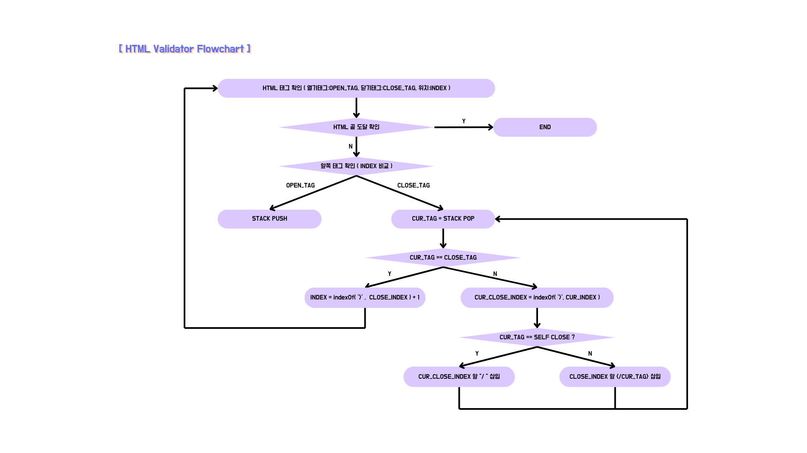

# R-HTML-Converter

1. 요구사항
    * HTML 을 Canvas 에 그대로 그릴 수 있어야한다.
    * Canvas 에 그린 그림을 여러 포멧으로 저장 할 수 있어야한다 ( png, jpg, pdf 등 )
    * 범위 지정 가능
    * Coverage 웹, 모바일까지
    * 메모리 누수 없어야 함.
    * NPM 배포 후 사용

2. 관련기술
    * ForeignObject
    * Canvas
    * Window.getComputedStyle

3. 개발방향
    * 변수
        - CSS List : 필요한 CSS 만 조회
        - Element : 캡쳐할 요소
        - left, top, width, height : 캡쳐할 요소 내부 캡쳐범위
        - ratio : 화면 비율
        - type : Converter Type
    * 공통함수
        - 변환 시 닫기 태그 탐색 > 전처리 필요
        - 반환 값으로 URL과 File Return 이 존재
        - 타입 체크 필요

4. 문제점
    * CrossOrigin 관련 오류 해결 필요

5. 참조
    * Html2Canvas
    * dom-to-image

6. 개발영역 구분
(1) HTML To Canvas
(2) 태그 유효성 검사 모듈
(3) 배포

7. 개발기간 및 인원
(1) 개발기간 : 10일
(2) 인원 : 2명

8. 진행상황
(1) 30% 정도 진행
(2) 오류 해결 필요
(3) 모듈화 진행 중

9. FlowChart

